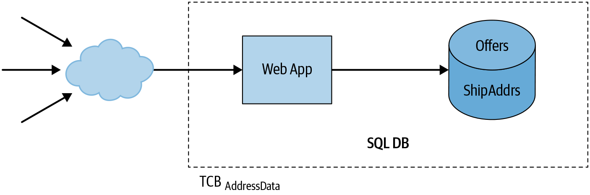
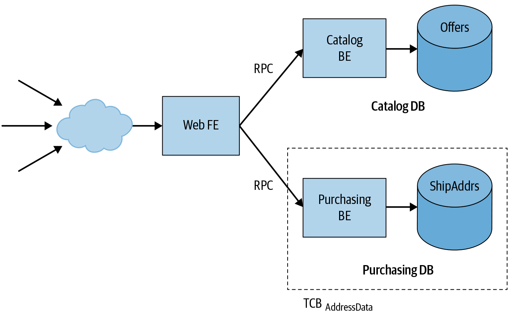
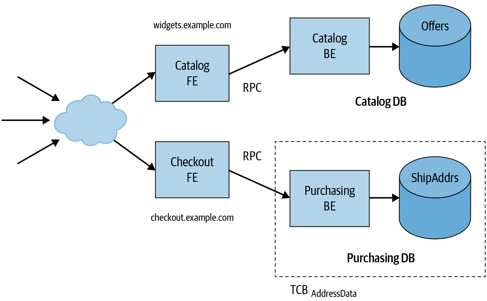

# Building Secure & Reliable Systems

- Security and reliability are everyone's responsibility.  
- There is not that traditional dividing lines between developers, architects, devops engineer, system administrators, and security engineers.
- everyone should be thinking about the fundamentals of reliability and security from the very beginning of the development process, and integrating those principles early in the system lifecycle.

## Reliability & Security Tradeoffs 
1. Redundancy:  
   While redundancy increases reliability, it also increases the attack surface. An adversary need only find a vulnerability in one path to be successful
2. Incident Management:  
   Reliability incidents benefit from having responders with multiple perspectives who can help find and mitigate the root cause quickly. By contrast, you’ll often want to handle security incidents with the smallest number of people who can fix the problem effectively, so the adversary isn’t tipped off to the recovery effort. 

## Commonalities
- **Invisibility:**  
Reliability and security are mostly invisible when everything is going well and unfortunately in the absence of emergencies that they’re often seen as costs that you can reduce or defer without immediate consequences. 
- **Assessment**  
- **Simplicity**   
Keeping system design as simple as possible is one of the best ways to improve your ability to assess both the reliability and the security of a system
- **Evolution**  
  No matter how simple and elegant the initial design, systems rarely remain unchanged over time. New feature requirements, changes in scale, and evolution of the underlying infrastructure all tend to introduce complexity.
- **Resilience**  
  - Systems should be designed to be resilient under adverse or unexpected circumstances.  
  - From the reliability perspective, such circumstances are often caused by unexpectedly high load or component failures.  
  - Distinct failure domains limit the “blast radius” of a failure and therefore also increase reliability. A good system design limits an adversary’s ability to exploit a compromised host or stolen credentials in order to move laterally or to escalate privilege and affect other parts of the system.
- **From Design to Production**
- **Investigating Systems and Logging**  
  You must assume that preventive mechanisms will fail, and craft a plan to detect and recover from failures.
  At sufficient scale, log volume poses a significant cost, and analyzing logs effectively can become difficult.
  logs typically should not contain sensitive information, such as authentication credentials or personally identifiable information (PII), lest the logs themselves become attractive targets for adversaries.
- **Crisis Response**
  Organizing crisis response is challenging, so it’s best to have a plan in place before an emergency occurs.
- **Recovery**
  Recovering from a security failure often requires patching systems to fix a vulnerability.

## Understanding Adversaries
### Attacker Motivations
- Fun: To undermine the security of a system for the sheer joy of knowing it can be done.
- Fame: To gain notoriety for showing off technical skills.
- Activism: To make a point or broadcast a message—typically, a political viewpoint— widely.
- Financial gain: To make money.
- Coercion: To get a victim to knowingly do something they don’t want to do.
- Manipulation: To create an intended outcome or change behavior—for example, by publishing false data (misinformation).
- Espionage: To gain information that might be valuable (spying, including industrial espionage). These attacks are often performed by intelligence agencies.
- Destruction: To sabotage a system, destroy its data, or just take it offline.

## Least Privilege 
- The principle of least privilege says that users should have the minimum amount of access needed to accomplish a task, regardless of whether the access is from humans or systems.
- These restrictions are most effective when you add them at the beginning of the development lifecycle, during the design phase of new features.
### Classifying access based on risk
Your goal should be to construct an access framework from which you can apply appropriate controls with the right balance of productivity, security, and reliability.  
From a reliability perspective, you might start with infrastructure controls, as you want to make sure unauthorized actors can’t shut down jobs, change ACLs, and misconfigure services. However, keep in mind that from a security perspective, reading sensitive data can often be just as damaging: overly broad read permissions can lead to a mass data breach.  
- Who should have access?
- How tightly should that access be controlled?
- What type of access does the user need (read/write)?
- What infrastructure controls are in place?

### Best Practices
#### Small Functional APIs
Make each program do one thing well. To do a new job, build afresh rather than complicate old programs by adding new “features.”  
#### Breakglass
a breakglass mechanism provides access to your system in an emergency situation and bypasses your authorization system completely.
#### Auditing
Auditing primarily serves to detect incorrect authorization usage. This can include a malicious system operator abusing their powers, a compromise of a user’s credentials by an external actor, or rogue software taking unexpected actions against another system. Your ability to audit and meaningfully detect the signal in the noise is largely dependent on the design of the systems you’re auditing:
- How granular is the access control decision being made or bypassed? (What? Where?)
- How clearly can you capture the metadata associated with the request? (Who? When? Why?)
- Collecting good audit logs
- Choosing an auditor

#### Testing and Least Privilege
#### Diagnosing Access Denials
- details about the reasons for a denial could be exploited to gain information about a system and even to find a way to gain access.
- There will always be tension between how much remediation information to expose and how much support overload the security policy team can handle.
#### Graceful Failure and Breakglass Mechanisms
- The ability to use a breakglass mechanism should be highly restricted. In general, it should be available only to your SRE team, which is responsible for the operational SLA of your system.
- The breakglass mechanism for zero trust networking should be available only from specific locations.
- All uses of a breakglass mechanism should be closely monitored.
- The breakglass mechanism should be tested regularly by the team(s) responsible for production services, to make sure it functions when you need it.

## Understandability
- In order to have confidence in your system’s security posture and its ability to reach its service level objectives (SLOs), you need to manage the system’s complexity: you must be able to meaningfully reason about and understand the system, its components, and their interactions.
- The degree to which a system is understandable can vary drastically across different properties.
- For example, it may be easy to understand a system’s behavior under high loads, but difficult to understand the system’s behavior when it encounters specially crafted (malicious) inputs.

### Why Is Understandability Important?
- Decreases the likelihood of security vulnerabilities or resilience failures'
- Facilitates effective incident response
- Increases confidence in assertions about a system’s security posture

### System Invariants
- A system invariant is a property that is always true, no matter how the system’s environment behaves or misbehaves. 
- The system is fully responsible for ensuring that a desired property is in fact an invariant, even if the system’s environment misbehaves in arbitrarily unexpected or malicious ways.

#### Examples:
- Only authenticated and properly authorized users can access a system’s persistent data store.
- All operations on sensitive data in a system’s persistent data store are recorded in an audit log in accordance with the system’s auditing policy.
- All values received from outside a system’s trust boundary are appropriately validated or encoded before being passed to APIs that are prone to injection vulnerabilities (e.g., SQL query APIs or APIs for constructing HTML markup).
- The number of queries received by a system’s backend scales relative to the number of queries received by the system’s frontend.
- If a system’s backend fails to respond to a query after a predetermined amount of time, the system’s frontend gracefully degrades—for example, by responding with an approximate answer.
- When the load on any component is greater than that component can handle, in order to reduce the risk of cascading failure, that component will serve overload errors rather than crashing.
- A system can only receive RPCs from a set of designated systems and can only send RPCs to a set of designated systems.

### Mental Models (Abstraction)
- Highly complex systems are difficult for humans to reason about in a holistic way.
- Mental models are useful because they simplify reasoning about a complex system.

### Complexity vs. Understandability
The primary enemy of understandability is unmanaged complexity.
- Breaking Down Complexity
- Centralized Responsibility for Security and Reliability Requirements
  - Improved understandability of the system (one place in order to understand and validate that a security/reliability)
  - Increased likelihood that the resulting system is actually correct

### System Architecture
- Understandable Interface Specifications
  - Prefer narrow interfaces that offer less room for interpretation  
    The lack of an explicit API specification also makes evaluating the security posture of the service difficult
  - Prefer interfaces that enforce a common object model  
    - Wrapper around the objects
    - Common object model lets engineers use a single mental model to understand large parts of a system.
  - Pay attention to idempotent operations
    - An idempotent operation will yield the same result when applied multiple times. For example, if a person pushes a button for floor two in an elevator, the elevator will go to the second floor every time. Pushing the button again, even multiple times, will not change the outcome.
    - In distributed systems, idempotency is important because operations may arrive out of order, or a server’s response after completing an operation may never reach the client.
- Understandable Identities, Authentication, and Access Control
  - Identities
    - An identity is the set of attributes or identifiers that relate to an entity.
    - Credentials assert the identity of a given entity.
    - Have understandable identifiers (A human must be able to understand who/what an identifier refers to without having to reference an external source)
    - Be robust against spoofing (private and public key)
    - Have non-reusable identifiers
    - Identity model for the Google production system
      - Administrators
      - Machines
      - Workloads (Scheduled tasks)
      - Customers
  - Authentication and transport security
    - Authentication and transport security are complicated disciplines that require specialized knowledge of areas like cryptography, protocol design, and operating systems.
    - It’s not reasonable to expect every engineer to understand all of these topics in depth.
    - Instead, engineers should be able to understand abstractions and APIs.
  - Access control
    - Using frameworks to codify and enforce access control policies for incoming service requests is a net benefit for the understandability of the global system.
    - Frameworks reinforce common knowledge and provide a unified way to describe policies, and are thus an important part of an engineer’s toolkit.
    - Frameworks can handle inherently complex interactions, such as the multiple identities involved in transferring data between workloads.
  
#### Security Boundaries
The trusted computing base (TCB) of a system is “the set of components (hardware, software, human, …) whose correct functioning is sufficient to ensure that the security policy is enforced, or more vividly, whose failure could cause a breach of the security policy.”
##### Example: a web application that allows users to buy widgets online
We want to guarantee that only the users themselves can access their own sensitive user data, such as shipping addresses.

Risks include a SQL injection vulnerability in the catalog search code allowing an attacker to obtain sensitive user data, like names or shipping addresses, or a remote code execution vulnerability in the web application server, permitting an attacker to read or modify any part of the application’s database.

**Small TCBs and strong security boundaries**  
We can improve the security of our design by splitting the application into microservices.  
In this architecture, each microservice handles a self-contained part of the application’s functionality and stores data in its own separate database.  
These microservices communicate with each other via RPCs and treat all incoming requests as not necessarily trustworthy, even if the caller is another internal microservice.

**Security boundaries and threat models**  
Web origin as a trusted origin. Now, web vulnerabilities such as XSS in the catalog UI cannot compromise the payment functionality, because that functionality is segregated into its own web origin.

